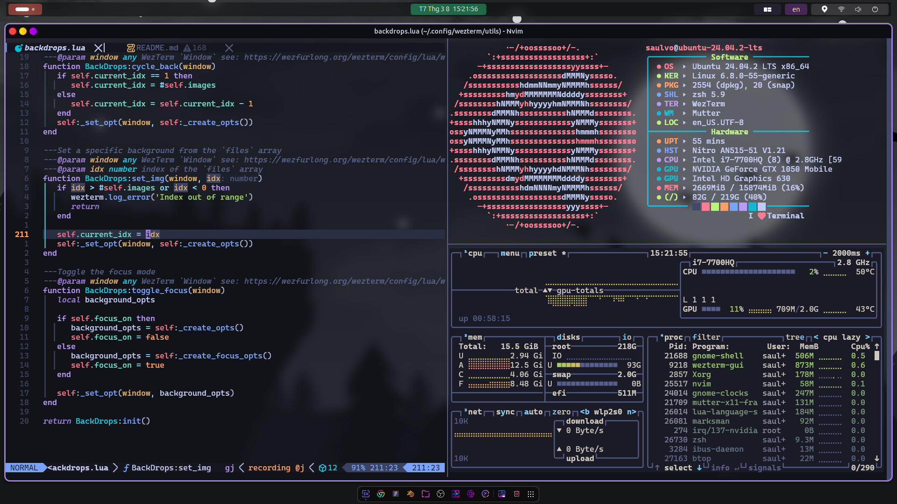

<h2 align="center">WezTerm Config</h2>

---

### Features

- [**Background Image Selector**](https://github.com/KevinSilvester/wezterm-config/blob/master/utils/backdrops.lua)

  - Cycle images
  - Fuzzy search for image
  - Toggle background image

  > See: [key bindings](#background-images) for usage

- [**GPU Adapter Selector**](https://github.com/KevinSilvester/wezterm-config/blob/master/utils/gpu_adapter.lua)

  > :bulb: Only works if the [`front_end`](https://github.com/KevinSilvester/wezterm-config/blob/master/config/appearance.lua#L8) option is set to `WebGpu`.

  A small utility to select the best GPU + Adapter (graphics API) combo for your machine.

  GPU + Adapter combo is selected based on the following criteria:

  1. 

     
Best GPU available

     `Discrete` > `Integrated` > `Other` (for `wgpu`'s OpenGl implementation on Discrete GPU) > `Cpu`
     

  2. 

     
Best graphics API available (based off my very scientific scroll a big log file in Neovim test 😁)

     > :bulb: 
     > The available graphics API choices change based on your OS. 
     > These options correspond to the APIs the `wgpu` crate (which powers WezTerm's gui in `WebGpu` mode) 
     > currently has support implemented for. 
     > See: <https://github.com/gfx-rs/wgpu#supported-platforms> for more info

     - Windows: `Dx12` > `Vulkan` > `OpenGl`
     - Linux: `Vulkan` > `OpenGl`
     - Mac: `Metal`

     

---

### All Key Bindings

Most of the key bindings revolve around a <kbd>SUPER</kbd> and <kbd>SUPER_REV</kbd>(super reversed) keys. 

- On MacOs:
  - <kbd>SUPER</kbd> ⇨ <kbd>Super</kbd>
  - <kbd>SUPER_REV</kbd> ⇨ <kbd>Super</kbd>+<kbd>Ctrl</kbd>
- On Windows and Linux
  - <kbd>SUPER</kbd> ⇨ <kbd>Alt</kbd>
  - <kbd>SUPER_REV</kbd> ⇨ <kbd>Alt</kbd>+<kbd>Ctrl</kbd>

> To avoid confusion when switching between different OS and to avoid conflicting 
> with OS's built-in keyboard shortcuts.

- On all platforms: <kbd>LEADER</kbd> ⇨ <kbd>SUPER_REV</kbd>+<kbd>Space</kbd>

#### Miscellaneous/Useful

| Keys                              | Action                                      |
| --------------------------------- | ------------------------------------------- |
| <kbd>F1</kbd>                     | `ActivateCopyMode`                          |
| <kbd>F2</kbd>                     | `ActivateCommandPalette`                    |
| <kbd>F3</kbd>                     | `ShowLauncher`                              |
| <kbd>F4</kbd>                     | `ShowLauncher` (tabs only)       |
| <kbd>F5</kbd>                     | `ShowLauncher` (workspaces only) |
| <kbd>F11</kbd>                    | `ToggleFullScreen`                          |
| <kbd>F12</kbd>                    | `ShowDebugOverlay`                          |
| <kbd>SUPER</kbd>+<kbd>f</kbd>     | Search Text                                 |
| <kbd>SUPER_REV</kbd>+<kbd>u</kbd> | Open URL                                    |

&nbsp;

#### Copy+Paste

| Keys                                          | Action               |
| --------------------------------------------- | -------------------- |
| <kbd>Ctrl</kbd>+<kbd>Shift</kbd>+<kbd>c</kbd> | Copy to Clipboard    |
| <kbd>Ctrl</kbd>+<kbd>Shift</kbd>+<kbd>v</kbd> | Paste from Clipboard |

&nbsp;

#### Cursor Movements

| Keys                                   | Action                                                     |
| -------------------------------------- | ---------------------------------------------------------- |
| <kbd>SUPER</kbd>+<kbd>LeftArrow</kbd>  | Move cursor to Line Start                                  |
| <kbd>SUPER</kbd>+<kbd>RightArrow</kbd> | Move cursor to Line End                                    |
| <kbd>SUPER</kbd>+<kbd>Backspace</kbd>  | Clear Line (does not work in PowerShell or cmd) |

&nbsp;

#### Tabs

##### Tabs: Spawn+Close

| Keys                              | Action                                |
| --------------------------------- | ------------------------------------- |
| <kbd>SUPER</kbd>+<kbd>t</kbd>     | `SpawnTab` (DefaultDomain) |
| <kbd>SUPER_REV</kbd>+<kbd>f</kbd> | `SpawnTab` (WSL:Ubuntu)    |
| <kbd>SUPER_REV</kbd>+<kbd>w</kbd> | `CloseCurrentTab`                     |

##### Tabs: Navigation

| Keys                              | Action         |
| --------------------------------- | -------------- |
| <kbd>SUPER</kbd>+<kbd>[</kbd>     | Next Tab       |
| <kbd>SUPER</kbd>+<kbd>]</kbd>     | Previous Tab   |
| <kbd>SUPER_REV</kbd>+<kbd>[</kbd> | Move Tab Left  |
| <kbd>SUPER_REV</kbd>+<kbd>]</kbd> | Move Tab Right |

##### Tabs: Title

| Keys                          | Action         |
| ----------------------------- | -------------- |
| <kbd>SUPER</kbd>+<kbd>9</kbd> | Toggle tab bar |

##### Tabs: Toggle Tab-bar

| Keys                              | Action             |
| --------------------------------- | ------------------ |
| <kbd>SUPER</kbd>+<kbd>0</kbd>     | Rename Current Tab |
| <kbd>SUPER_REV</kbd>+<kbd>0</kbd> | Undo Rename        |

&nbsp;

#### Windows

| Keys                          | Action               |
| ----------------------------- | -------------------- |
| <kbd>SUPER</kbd>+<kbd>n</kbd> | `SpawnWindow`        |
| <kbd>SUPER</kbd>+<kbd>=</kbd> | Increase Window Size |
| <kbd>SUPER</kbd>+<kbd>-</kbd> | Decrease Window Size |

&nbsp;

#### Panes

##### Panes: Split Panes

| Keys                               | Action                                           |
| ---------------------------------- | ------------------------------------------------ |
| <kbd>SUPER</kbd>+<kbd>\\</kbd>     | `SplitVertical` (CurrentPaneDomain)   |
| <kbd>SUPER_REV</kbd>+<kbd>\\</kbd> | `SplitHorizontal` (CurrentPaneDomain) |

##### Panes: Zoom+Close Pane

| Keys                              | Action                |
| --------------------------------- | --------------------- |
| <kbd>SUPER</kbd>+<kbd>Enter</kbd> | `TogglePaneZoomState` |
| <kbd>SUPER</kbd>+<kbd>w</kbd>     | `CloseCurrentPane`    |

##### Panes: Navigation

| Keys                              | Action                  |
| --------------------------------- | ----------------------- |
| <kbd>SUPER_REV</kbd>+<kbd>k</kbd> | Move to Pane (Up)       |
| <kbd>SUPER_REV</kbd>+<kbd>j</kbd> | Move to Pane (Down)     |
| <kbd>SUPER_REV</kbd>+<kbd>h</kbd> | Move to Pane (Left)     |
| <kbd>SUPER_REV</kbd>+<kbd>l</kbd> | Move to Pane (Right)    |
| <kbd>SUPER_REV</kbd>+<kbd>p</kbd> | Swap with selected Pane |

##### Panes: Scroll Pane

| Keys                          | Action                               |
| ----------------------------- | ------------------------------------ |
| <kbd>SUPER</kbd>+<kbd>u</kbd> | Scroll Lines up 5 lines   |
| <kbd>SUPER</kbd>+<kbd>d</kbd> | Scroll Lines down 5 lines |
| <kbd>PageUp</kbd>             | Scroll Page up                       |
| <kbd>PageDown</kbd>           | Scroll Page down                     |

&nbsp;

#### Background Images

| Keys                              | Action                       |
| --------------------------------- | ---------------------------- |
| <kbd>SUPER</kbd>+<kbd>/</kbd>     | Select Random Image          |
| <kbd>SUPER</kbd>+<kbd>,</kbd>     | Cycle to next Image          |
| <kbd>SUPER</kbd>+<kbd>.</kbd>     | Cycle to previous Image      |
| <kbd>SUPER_REV</kbd>+<kbd>/</kbd> | Fuzzy select Image           |
| <kbd>SUPER</kbd>+<kbd>b</kbd>     | Toggle background focus mode |

&nbsp;

#### Key Tables

> See: <https://wezfurlong.org/wezterm/config/key-tables.html>

| Keys                           | Action        |
| ------------------------------ | ------------- |
| <kbd>LEADER</kbd>+<kbd>f</kbd> | `resize_font` |
| <kbd>LEADER</kbd>+<kbd>p</kbd> | `resize_pane` |

##### Key Table: `resize_font`

| Keys           | Action                          |
| -------------- | ------------------------------- |
| <kbd>k</kbd>   | `IncreaseFontSize`              |
| <kbd>j</kbd>   | `DecreaseFontSize`              |
| <kbd>r</kbd>   | `ResetFontSize`                 |
| <kbd>q</kbd>   | `PopKeyTable` (exit) |
| <kbd>Esc</kbd> | `PopKeyTable` (exit) |

##### Key Table: `resize_pane`

| Keys           | Action                                         |
| -------------- | ---------------------------------------------- |
| <kbd>k</kbd>   | `AdjustPaneSize` (Direction: Up)    |
| <kbd>j</kbd>   | `AdjustPaneSize` (Direction: Down)  |
| <kbd>h</kbd>   | `AdjustPaneSize` (Direction: Left)  |
| <kbd>l</kbd>   | `AdjustPaneSize` (Direction: Right) |
| <kbd>q</kbd>   | `PopKeyTable` (exit)                |
| <kbd>Esc</kbd> | `PopKeyTable` (exit)                |
